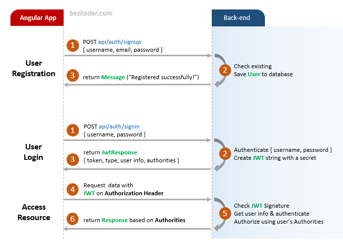
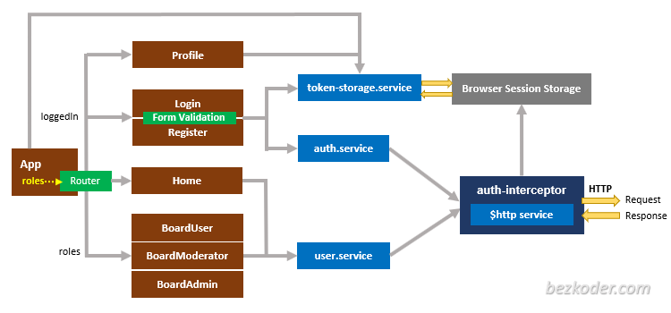

# Angular 10 JWT Authentication example

## Note by endriazizi

ng generate class /model/player --type=model
ng generate c components/player-create
ng generate c components/player-edit
ng generate c components/player-list
ng g s _services/player.service


ng generate class /models/squadra/squadra --type=model
ng generate c components/squadra-create
ng generate c components/squadra-edit
ng generate c components/squadra-list

ng g s _services/squadra.service


ng generate class /models/evento/evento --type=model
ng generate c components/evento-create
ng generate c components/evento-edit
ng generate c components/evento-list

ng g s _services/eventoservice


ng generate component componenti/navigazione

ng generate component componenti/navigazione


ng generate component componenti/disciplina


ng g s _services/disciplina/disiplina

ng generate class /models/disciplina/disciplina --type=model

## componenti azzurra

ng generate component componenti/homepage
ng generate component componenti/about


ng generate component componenti/onepage


ng g s _services/atleti/atleti

ng generate class /models/atleta/atleta --type=model


## Flow for User Registration and User Login
For JWT – Token based Authentication with Web API, we’re gonna call 2 endpoints:
- POST `api/auth/signup` for User Registration
- POST `api/auth/signin` for User Login

You can take a look at following flow to have an overview of Requests and Responses that Angular 10 Client will make or receive.



## Angular JWT App Diagram with Router and HttpInterceptor


For more detail, please visit:
> [Angular 10 JWT Authentication with Web API](https://bezkoder.com/angular-10-jwt-auth/)

## With Spring Boot back-end

> [Angular 10 + Spring Boot: JWT Authentication & Authorization example](https://bezkoder.com/angular-10-spring-boot-jwt-auth/)

Run `ng serve` for a dev server. Navigate to `http://localhost:4200/`.

## With Node.js Express back-end

> [Angular 10 + Node.js Express: JWT Authentication & Authorization example](https://bezkoder.com/node-js-express-angular-10-jwt-auth/)

Open `app/_helpers/auth.interceptor.js`, modify the code to work with **x-access-token** like this:
```js
...

// const TOKEN_HEADER_KEY = 'Authorization'; // for Spring Boot back-end
const TOKEN_HEADER_KEY = 'x-access-token';   // for Node.js Express back-end

@Injectable()
export class AuthInterceptor implements HttpInterceptor {
  ...

  intercept(req: HttpRequest<any>, next: HttpHandler): Observable<HttpEvent<any>> {
    ...
    if (token != null) {
      // for Spring Boot back-end
      // authReq = req.clone({ headers: req.headers.set(TOKEN_HEADER_KEY, 'Bearer ' + token) });

      // for Node.js Express back-end
      authReq = req.clone({ headers: req.headers.set(TOKEN_HEADER_KEY, token) });
    }
    return next.handle(authReq);
  }
}

...
```

Run `ng serve --port 8081` for a dev server. Navigate to `http://localhost:8081/`.

## More practice

> [Angular 10 CRUD application example with Web API](https://bezkoder.com/angular-10-crud-app/)

> [Angular 10 Pagination example | ngx-pagination](https://github.com/bezkoder/angular-10-pagination-example)

> [Angular 10 File Upload example with progress bar](https://bezkoder.com/angular-10-file-upload/)

Fullstack with Node.js Express:
> [Angular 10 + Node.js Express + MySQL](https://bezkoder.com/angular-10-node-js-express-mysql/)

> [Angular 10 + Node.js Express + PostgreSQL](https://bezkoder.com/angular-10-node-express-postgresql/)

> [Angular 10 + Node.js Express + MongoDB](https://bezkoder.com/angular-10-mongodb-node-express/)

Fullstack with Spring Boot:
> [Angular 10 + Spring Boot + MySQL](https://bezkoder.com/angular-10-spring-boot-crud/)

> [Angular 10 + Spring Boot + PostgreSQL](https://bezkoder.com/angular-10-spring-boot-postgresql/)

> [Angular 10 + Spring Boot + MongoDB](https://bezkoder.com/angular-10-spring-boot-mongodb/)

Fullstack with Django:
> [Angular 10 + Django Rest Framework](https://bezkoder.com/django-angular-10-crud-rest-framework/)

Integration (run back-end & front-end on same server/port)
> [How to Integrate Angular 10 with Node.js Restful Services](https://bezkoder.com/integrate-angular-10-node-js/)

> [How to Integrate Angular with Spring Boot Rest API](https://bezkoder.com/integrate-angular-spring-boot/)